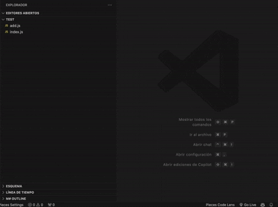

# openai-unit-test-generator README

This extension leverages OpenAI's API to automatically generate comprehensive unit tests for your code in JavaScript, TypeScript, and Python. It analyzes your code—including its relative import statements—to provide context and generate tests that aim for 100% code coverage.

## Features

- **Automatic Unit Test Generation:**  
  Generate complete unit tests for the open file or via the Explorer context menu with a single command.
  
- **Context-Aware Testing:**  
  The extension extracts relative import statements (e.g., `import './module'` or `require('../module')`) from your code to provide additional context for generating more accurate tests.
  
- **100% Coverage Focus:**  
  Instructs the AI to create tests that cover every function, branch, and edge case in your code, ensuring full coverage.
  
- **Multi-Language Support:**  
  Works with JavaScript, TypeScript, and Python files.

> **Tip:** Check out the screenshot/animation below to see the extension in action.  
> 

## Requirements

- A valid OpenAI API key is required to use this extension.
- An active internet connection to send requests to the OpenAI API.
- Visual Studio Code version **1.76.0** or higher.

## Extension Settings

This extension contributes the following settings (accessible via VS Code's Settings UI):

- **`openai-unit-test-generator.apiKey`**  
  Your OpenAI API key.

- **`openai-unit-test-generator.mainModel`**  
  The primary OpenAI model to use for generating unit tests (default: `o3-mini`).

- **`openai-unit-test-generator.fallbackModel`**  
  The fallback OpenAI model to use if the primary fails (default: `o3-mini`).

## Known Issues

- Generated tests might occasionally miss some edge cases if the source code is highly complex.  
- Ensure that your API key is valid and that you have a stable internet connection.
- If tests fail to run or cover all paths, try generating tests again or check your code for unusual constructs.

## Release Notes

### 0.0.1

- Initial release of **openai-unit-test-generator**.
- Supports unit test generation for JavaScript, TypeScript, and Python.
- Extracts relative import statements to provide contextual information.
- Instructs the AI to generate tests with 100% coverage, including all functions and branches.

**Enjoy using openai-unit-test-generator!**
